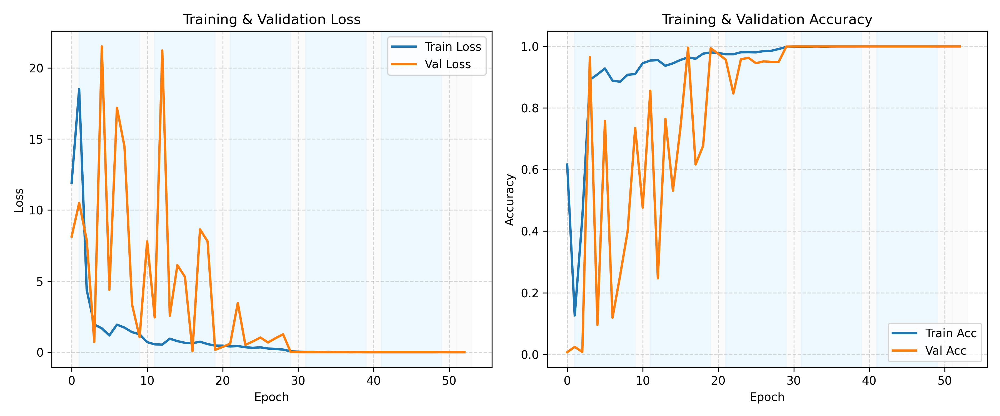

## Project Overview

This project focuses on training a deep learning model for facial image classification as part of an autism-related research study.

The repository includes a representative implementation of the data preprocessing and training pipeline used during the project. The model was developed through iterative experimentation, including hyperparameter tuning and various data augmentation techniques to improve generalisation performance.

Key aspects of the approach include:

- Data preprocessing and augmentation to enhance dataset diversity and robustness  
- Model training using gradient-based optimisation methods  
- Early stopping strategy to prevent overfitting and improve model generalisation  
- Iterative tuning of model parameters and training configurations  

Multiple training strategies and configurations were explored during development. The version included here reflects one of the effective approaches used to achieve strong validation performance.

This project demonstrates practical experience in building and refining deep learning models, as well as applying machine learning techniques to real-world classification tasks.

## Model Performance
The model achieved a final accuracy of 0.98. The training and validation losses
dropped sharply at the beginning and gradually plateaued, accompanied by a rapid
increase in accuracy. Some fluctuations were observed in the validation curve during
the early training phase, but the curve became smooth and stable after about 30
epochs. It showed on Figure below.
However, the accuracy dropped 10% when the learning rate reduced to 0.0005,
and by 7% when illumination uniformity was applied. The decrease in accuracy with
the lower learning rate is likely due to the local minima rather than reaching a better
global optimum. The decline observed after applying illumination uniformity may be
related to changes in image contrast and brightness distribution– the prepossessing
might have removed subtle texture or shading cues that were informative for facial
feature discrimination in ASD classification

The following plots show the training and validation performance during model training.

### Accuracy & Loss Curve

Figure: Large dataset (ASD:3556, TD:4364) training and validation curves with
data augmentation and noise reduction

## Additional Experiments

During the research, multiple datasets and training strategies were explored, including experiments across different demographic groups to evaluate model robustness and generalisation. Detailed experimental setups and results are documented in the full research report.
